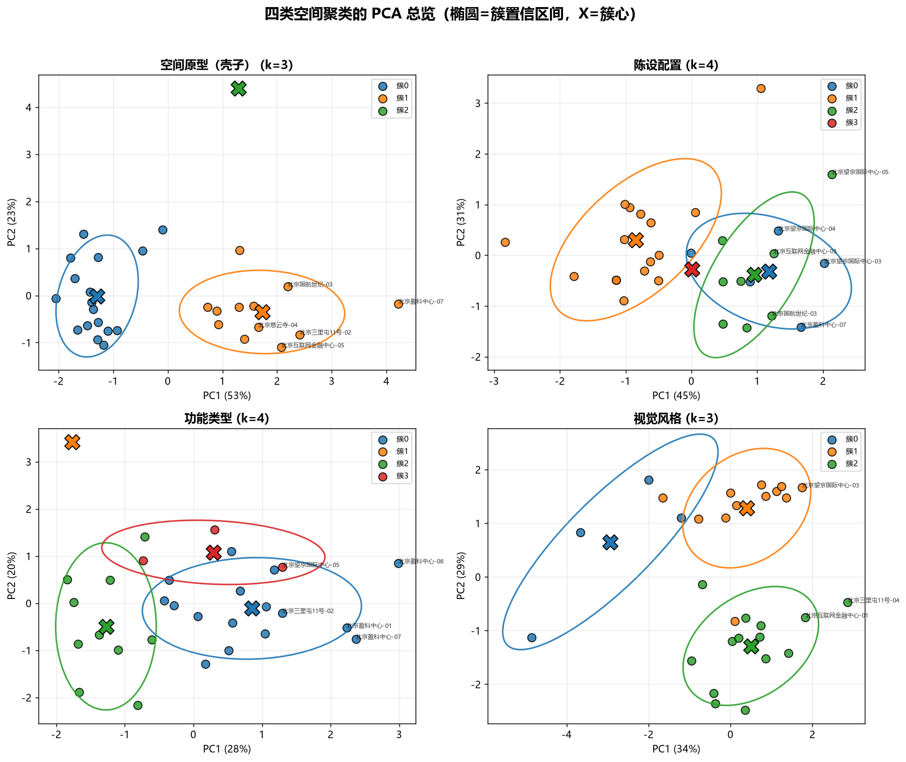
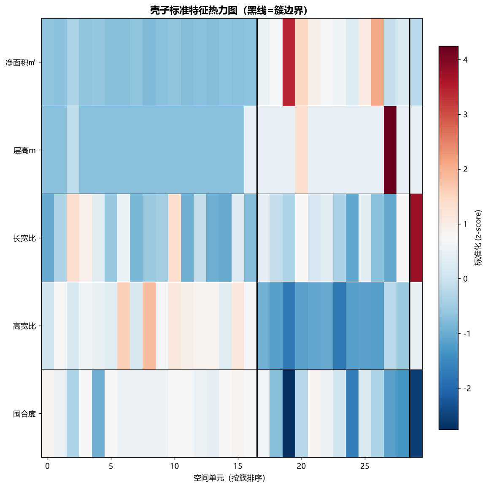
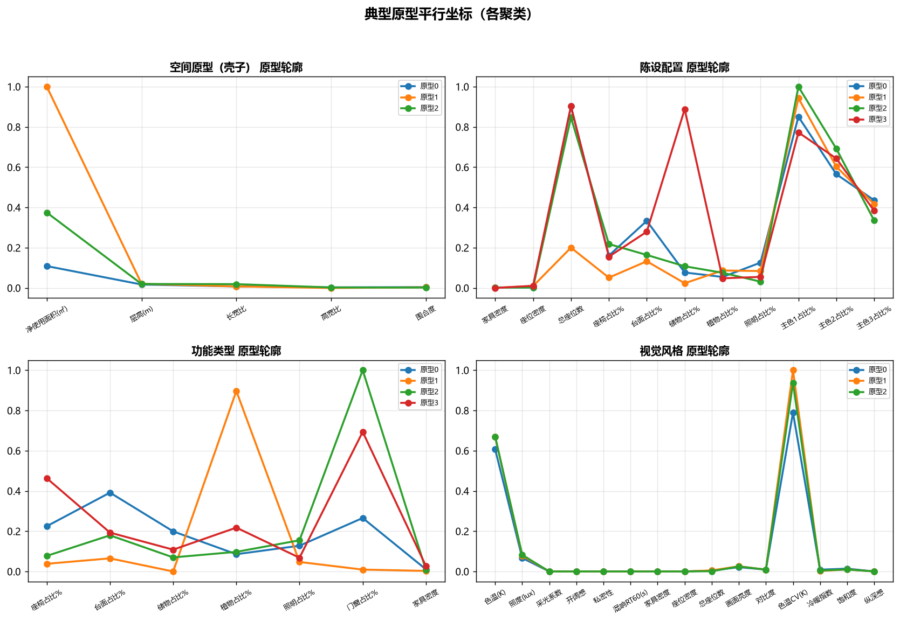
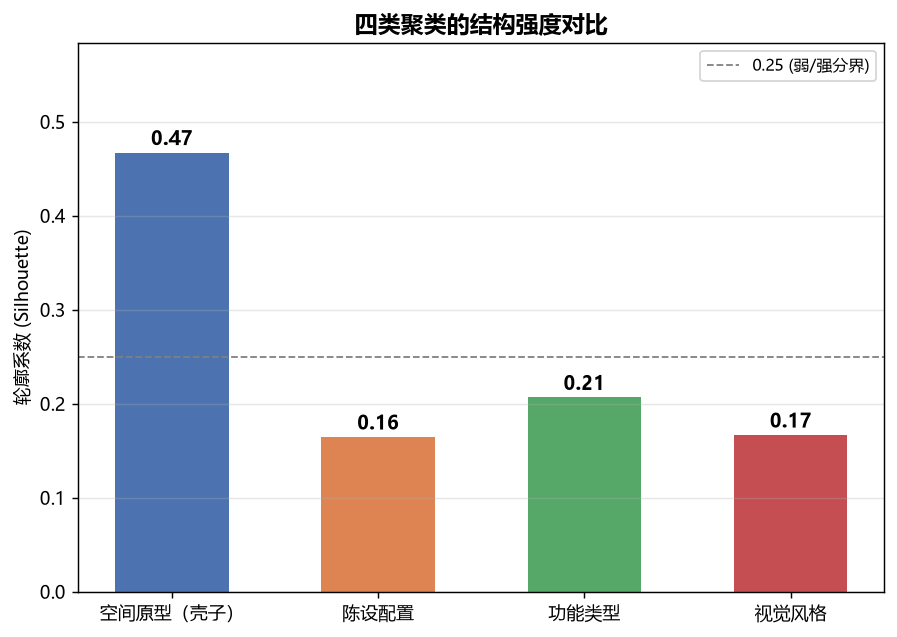
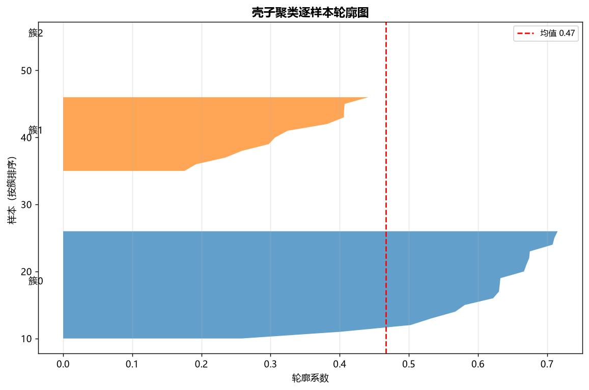

# 共享办公空间聚类分析汇报

> 基于 30 个共享办公空间单元的 56 维特征，对**壳子（空间原型）/ 陈设配置 / 功能类型 / 视觉风格**四个维度做了聚类分析。

## 一、方法与数据

1. **样本**：30 个共享办公空间单元（盈科中心/国航世纪/望京国际中心/慈云寺/互联网金融中心/三里屯 6 个项目）。
2. **特征**：每单元 56 维（LLM 语义 + DXF 几何 + OpenCV/Mask2Former 像素级），按**分析维度选取特征子集**（壳子5字段 / 陈设配置 / 功能占比 / 视觉风格）。
3. **算法**：K-means（+ Ward 层次对照），特征标准化（分类字段 One-Hot），**轮廓系数定 k**（30 样本 k≤5）。

## 二、四类聚类结果汇总

| 聚类 | k | 轮廓系数 | 结构强度 | 典型原型 |
|------|:--:|:--:|:--:|--------|
| 空间原型（壳子）| 3 | **0.47** | **强** | 小型封闭 / 大型开放 / 狭长(特殊) |
| 陈设配置 | 4 | 0.16 | 弱 | 高密度 / 中密度 / 低密度（分界弱）|
| 功能类型 | 4 | 0.21 | 弱 | 办公主导 / 通透主导 |
| 视觉风格 | 3 | 0.17 | 弱 | 暖亮 / 私密明亮 / 高密度开放 |

**核心结论**：仅**壳子维度**具有清晰聚类结构（轮廓系数 0.47）；陈设配置/功能/风格的轮廓系数均低（0.16~0.21），说明样本在陈设配置、功能构成、视觉风格上**高度同质**（以办公/会议类型为主）。

## 三、各聚类方向原型明细

### 空间原型（壳子）（k=3）

| 原型 | 净使用面积(㎡) | 层高(m) | 长宽比 | 高宽比 | 围合度 | 解读 | 单元数 |
|------|------|------|------|------|------|------|------|
| 0 | 16.14 | 2.83 | 1.43 | 0.77 | 0.93 | 小型封闭办公室 | 17 |
| 1 | 145.79 | 3.33 | 1.47 | 0.33 | 0.83 | 大型开放协作区 | 12 |
| 2 | 54.83 | 3.2 | 3.1 | 0.71 | 0.62 | 狭长走廊型（特殊） | 1 |

### 陈设配置（k=4）

| 原型 | 家具密度 | 座位密度 | 总座位数 | 座椅占比% | 台面占比% | 储物占比% | 解读 | 单元数 |
|------|------|------|------|------|------|------|------|------|
| 0 | 0.32 | 0.29 | 35 | 6.41 | 13.06 | 3.18 | 高座位·多台面·中型 | 5 |
| 1 | 0.27 | 0.58 | 7.94 | 2.2 | 5.33 | 1.13 | 低座位·小型密集 | 16 |
| 2 | 0.29 | 0.31 | 32.88 | 8.63 | 6.54 | 4.37 | 高座椅·中台面·中型 | 8 |
| 3 | 0.22 | 0.64 | 35 | 6.21 | 10.98 | 34.44 | 高储物·特殊 | 1 |

### 功能类型（k=4）

| 原型 | 座椅占比% | 台面占比% | 储物占比% | 植物占比% | 照明占比% | 门窗占比% | 解读 | 单元数 |
|------|------|------|------|------|------|------|------|------|
| 0 | 5.52 | 9.62 | 4.89 | 2.11 | 3.14 | 6.52 | 综合办公型 | 16 |
| 1 | 0.94 | 1.6 | -0 | 22.02 | 1.16 | 0.23 | 高绿植·特殊 | 1 |
| 2 | 1.9 | 4.41 | 1.72 | 2.39 | 3.81 | 24.56 | 高门窗通透型 | 10 |
| 3 | 11.37 | 4.74 | 2.66 | 5.35 | 1.68 | 17.03 | 高密度·混合型 | 3 |

### 视觉风格（k=3）

| 原型 | 色温(K) | 照度(lux) | 采光系数 | 开阔感 | 私密性 | 混响RT60(s) | 解读 | 单元数 |
|------|------|------|------|------|------|------|------|------|
| 0 | 3625 | 400 | -0.23 | 0.68 | 0.35 | 0.8 | 暖调高饱和·开放型 | 4 |
| 1 | 4000 | 466.67 | 0.03 | 0.68 | 0.33 | 0.79 | 明亮中性·开放型 | 12 |
| 2 | 4000 | 492.86 | -0.2 | 0.45 | 0.79 | 0.69 | 私密·明亮型 | 14 |

> 壳子 3 个原型将作为 VR 实验空间的**控制变量**，在各自壳子内放置不同陈设方案做脑电实验。

## 四、可视化

## 五、发现与意义

- **样本同质**：共享办公空间在陈设配置/功能/风格维度趋同 → 真实样本差异主要在**壳子尺度**。
- **数据可靠性**：聚类过程发现并修复了 2 个净面积计算 bug（互联网金融中心-03、望京中心-03），修复后数据更可靠。
- **实验设计启示**：因真实样本陈设趋同，VR 实验需**人为构造陈设方案差异**（密度/复杂度/秩序度）以形成自变量。
